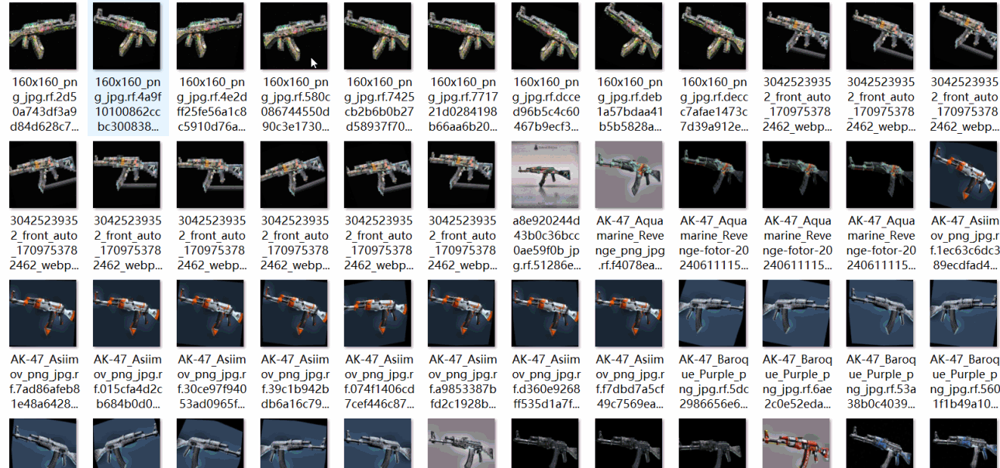
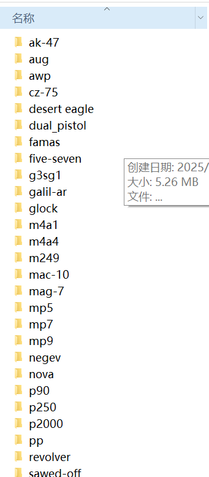

# [Object Detection] CSGOWeapon Classification Dataset 8000 images34 typesjpgformat

​

【】『The weapons in CS include a variety of types such as pistols, rifles, assault rifles, shotguns, sniper rifles, and heavy weapons.』

Hand Gun

USP silenced version: A default pistol in CT, with high precision but fewer rounds available, suitable for silent combat.

P2000：With a variety of ammunition and high accuracy in the first shot, it is suitable for players at the mid to low levels.

Glock-18: The default pistol, with lower damage and penetration but advantages in close-range combat.

P250: Affordable, suitable for economic bureaus.

Five-Seven: High Precision, Suitable for Medium to Long Range Shooting.

CZ75 automatic pistols, Tec-9, Desert Eagle, R8 revolvers, and Dual Berettas are among the many types.

stepGun

AK-47: High damage but has a large recoil, suitable for experienced players.

M4A1-S: Low recoil, high precision, commonly used by professional players.

AWP: High damage, long range, key weapon in the game.

‌M4A4‌、‌SG 553‌、‌G3SG1‌etc 。

Machine gun

MAC-10, MP9, UMP-45, PP-Bizon: Suitable for rapid fire and surprise attacks.

Shotgun

Nova, MAG-7, Sawed-Off, XM1014, Negev: Close combat tools.

other Weapon

M249: Dual-camp weapon, suitable for team combat.

AWP (Other Versions) : Such as the Legend of Giant Dragons etc.

FAMAS, Galil AR, etc.: Suitable for long-range shooting.

The weapons in the game each have their own characteristics, and players can select the appropriate weapon according to tactical needs for battle.

​Edit

​

## Images

---

Here is a pay link on Stripe (https://buy.stripe.com/3cs8yP7sY87d0vu9AB). Please contact me lonlonago@foxmail.com after funding $89, and I will send you a complete data files, thank you!

